# Project_template

# Задание 1. Анализ и планирование


### 1. Описание функциональности монолитного приложения

**Управление отоплением:**

- Пользователи могут удалённо подключать сенсоры отопления в своих домах через веб-интерфейс.
- Система поддерживает:
  - Создать сенсор: передаются имя, тип, локация и единица измерения
  - Удалить сенсор
  - Обновить данные сенсора: имя, локацию и единицу измерения
  - Передать значение температуры сенсора, но в дальнейшем при запросах температуры эти значения не используются

**Мониторинг температуры:**

- Пользователи могут просматривать текущую температуру в своих домах через веб-интерфейс.
- Система поддерживает:
  - Получить данные по всем сенсорам с текущей температурой
  - Получить данные одного сенсора с текущей температурой
  - Получить температуру в конкретной локации

### 2. Анализ архитектуры монолитного приложения

- Язык разработки: Go 
- Http роутер: Gin
- Хранилище данных: postgres
- Синхронный подход к получению данных:
  - клиент → монолит → (1) база за метаданными, (2) внешний
    temperature-api за значением
- Архитектура приложения состоит из слоёв:
  - Сетевой слой (хендлеры)
  - Сервисный слой для внешнего API
  - Репозиторий (DB) для CRUD, используется в сетевом слое
- Конфигурация через переменные среды
- Деплой и сборка осуществляются в docker-контейнерах
- Миграции базы данных вручную
- Для получения данных о температуре используются запросы во внешний сервис — есть внешняя зависимость.
- Нет внутреннего состояния, можно деплоить за балансировщиком несколько экземпляров сервиса.

### 3. Определение доменов и границы контекстов

- **Домен «Устройства»** *(Core)* — отвечает за метаданные и управление всеми устройствами, подключение устройств через коннекторы внешних провайдеров умных домов.
- **Домен «Автоматизация»** *(Core)* — отвечает за цепочки автоматизации устройств в умном доме.
- **Домен «Телеметрия»** *(Supporting)* — отвечает за сбор, анализ и выдачу данных телеметрии устройств.
- **Домен «Пользователи»** *(Supporting)* — отвечает за AAA (аутентификация, авторизация, аудит) и хранение пользовательских данных.
- **Домен «Уведомления»** *(Supporting)* — внешний сервис, отвечает за отправку и логику уведомлений всей системы.

### 4. Проблемы монолитного решения

- Синхронное взаимодействие всех компонентов.
- Зависимость от внешнего сервиса temperature-api — большой риск отказа.
- Нет истории телеметрии.
- Нет функций управления сенсорами, только наблюдение.
- Бизнес-логика в хендлерах, нет разделения на слои сервиса.
- Нет единого источника данных о значении температуры.
- ID локаций и устройств — не понятно, как согласовывать между двумя сервисами.

### 5. Визуализация контекста системы — диаграмма С4

Диаграмма контекста (C4 Context) в двух состояниях: **As-Is** — текущий монолит, **To-Be** — целевая экосистема умного дома.

**As-Is (как сейчас)** — монолит, который синхронно ходит во внешний `temperature-api`.

Исходник: [`c1-context-as-is.puml`](docs/diagrams/c1-context-as-is.puml)

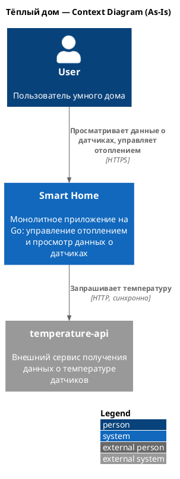

**To-Be (как планируется)** — экосистема умного дома: управление разными устройствами партнёров, телеметрия, автоматизация, уведомления.

Исходник: [`c1-context-to-be.puml`](docs/diagrams/c1-context-to-be.puml)

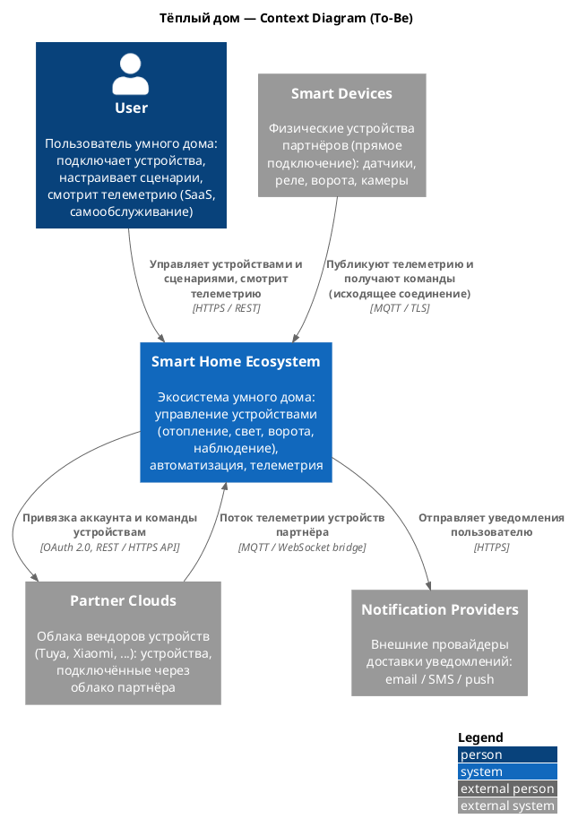

# Задание 2. Проектирование микросервисной архитектуры

Исходные `.puml`-файлы лежат в `docs/diagrams/`.

**Диаграмма контейнеров (Containers)**

Показывает все микросервисы, их БД (Database per service), шины сообщений (MQTT для устройств, NATS между сервисами) и потоки взаимодействия: синхронные (REST) и асинхронные.

Исходник: [`docs/diagrams/c2-containers.puml`](docs/diagrams/c2-containers.puml)

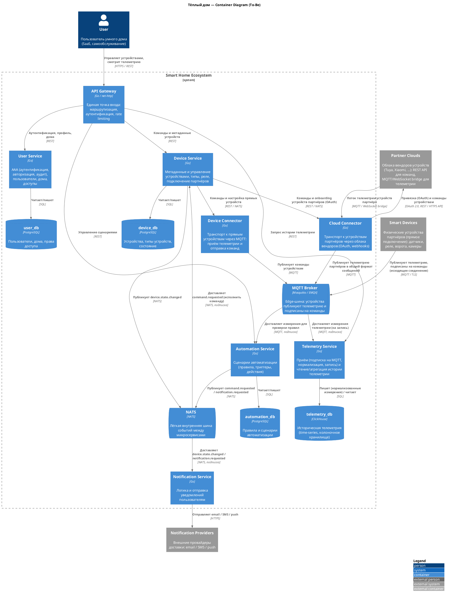

**Диаграмма компонентов (Components)**

Диаграмма компонентов для каждого выделенного микросервиса.

*User Service* — AAA, пользователи, дома, доступы. Исходник: [`c3-user-service.puml`](docs/diagrams/c3-user-service.puml)

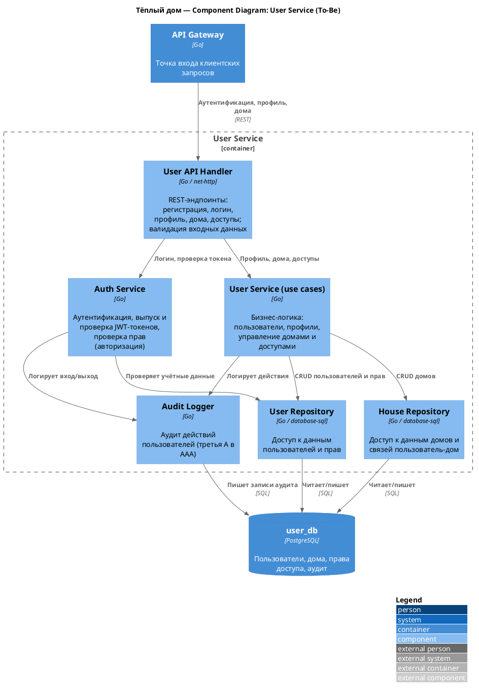

*Device Service* — метаданные и управление устройствами, команды, состояние. Исходник: [`c3-device-service.puml`](docs/diagrams/c3-device-service.puml)

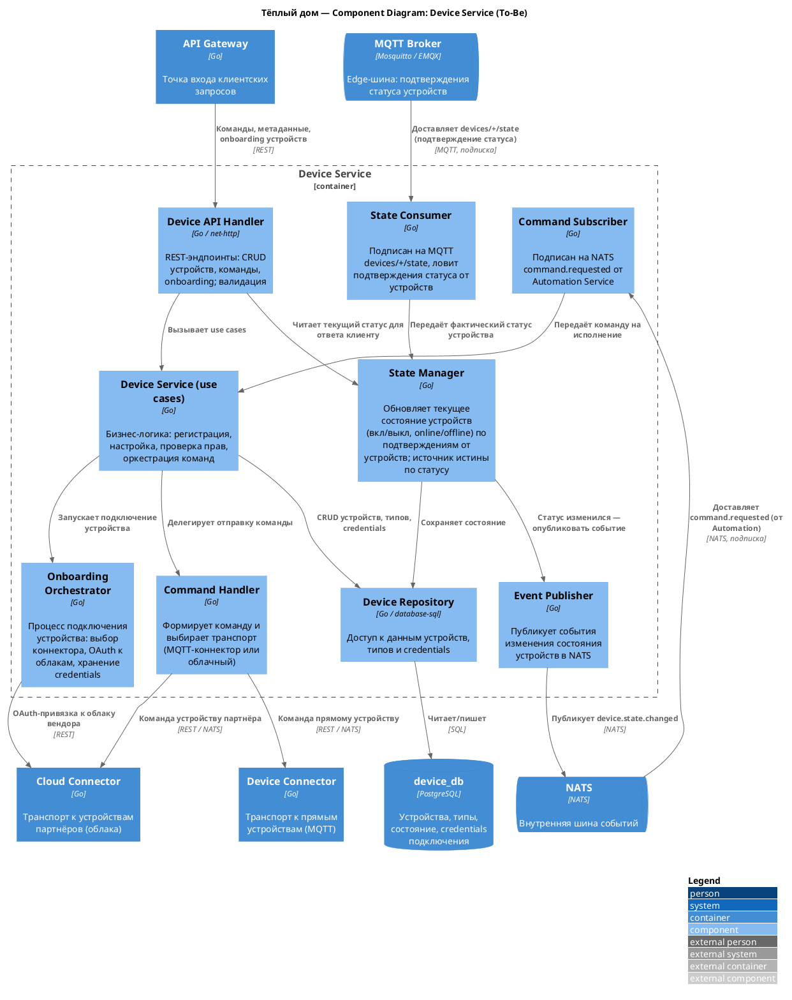

*Automation Service* — правила, движок и исполнитель сценариев автоматизации. Исходник: [`c3-automation-service.puml`](docs/diagrams/c3-automation-service.puml)

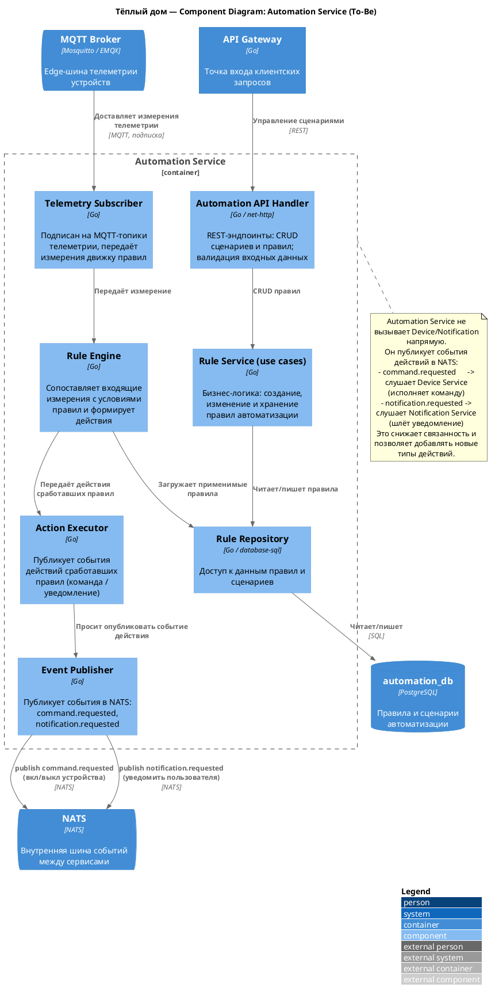

*Telemetry Service* — владеет всей телеметрией: write path (подписка на MQTT → нормализация/валидация → запись в ClickHouse) и read path (история и агрегаты по REST). Исходник: [`c3-telemetry-service.puml`](docs/diagrams/c3-telemetry-service.puml)

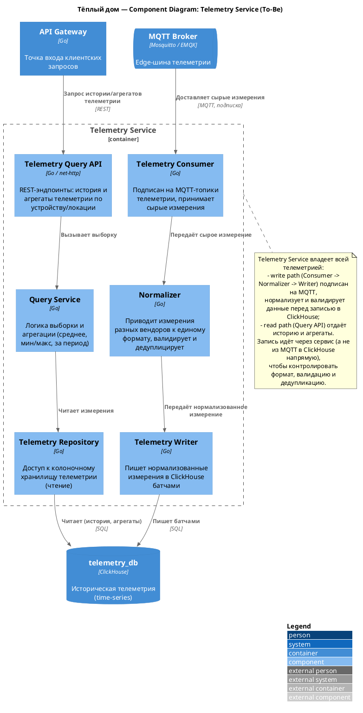

*Notification Service* — обработка событий и отправка уведомлений через провайдеров. Исходник: [`c3-notification-service.puml`](docs/diagrams/c3-notification-service.puml)

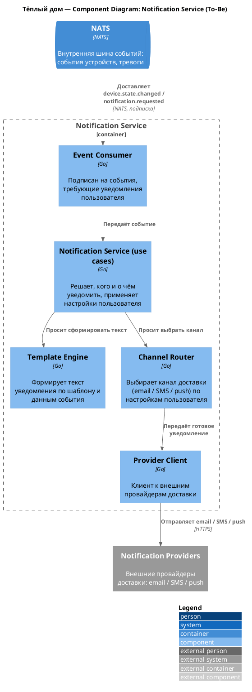

*Device Connector* — транспорт команд к прямым устройствам через MQTT: публикует команды в `devices/{id}/commands` (QoS 1). Приём телеметрии — ответственность Telemetry Service (подписан на MQTT). Устройства подключаются исходящим соединением, что решает проблему доступа за NAT. Исходник: [`c3-device-connector.puml`](docs/diagrams/c3-device-connector.puml)

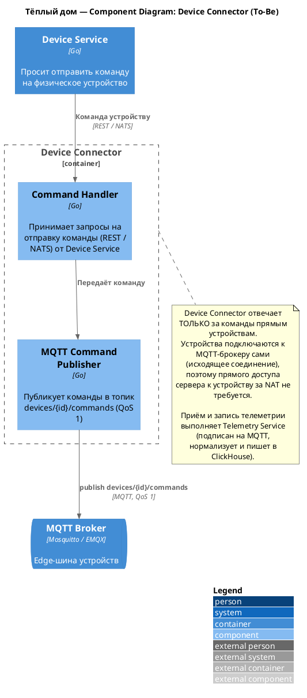

*Cloud Connector* — транспорт к устройствам партнёров через облака вендоров (Tuya, Xiaomi и т.п.): OAuth-привязка, приём телеметрии через webhooks, отправка команд через API облака. Структурно аналогичен Device Connector (адаптеры под вендоров + нормализатор), поэтому отдельная диаграмма компонентов не приводится; показан на диаграмме контейнеров.

**Диаграмма кода (Code)**

Диаграмма последовательности для самого критичного сквозного сценария — срабатывания сценария автоматизации. Показывает edge-взаимодействие через MQTT (телеметрия и команды устройств), синхронную команду через REST и внутреннее событие через NATS.

Исходник: [`c4-code-automation-sequence.puml`](docs/diagrams/c4-code-automation-sequence.puml)

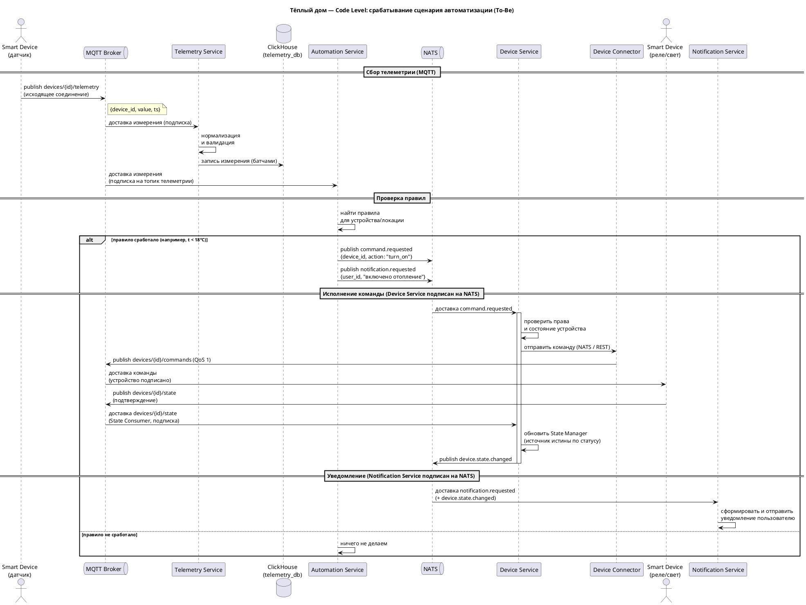

# Задание 3. Разработка ER-диаграммы

ER-диаграмма логической модели данных целевой системы (To-Be). Сущности сгруппированы по микросервисам (Database per service).

Исходник: [`er-diagram.puml`](docs/diagrams/er-diagram.puml)

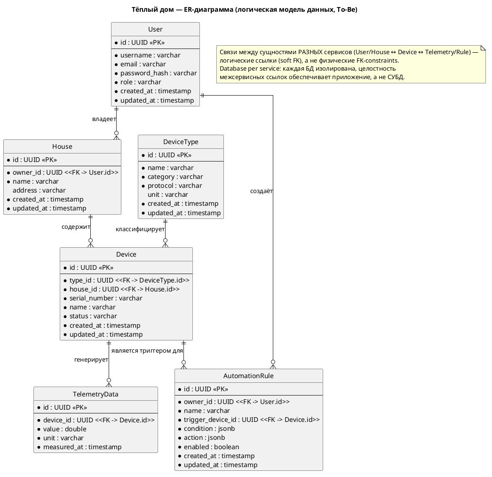

**Сущности:**

| Сущность | Назначение | Сервис (БД) |
|---|---|---|
| `User` | Пользователь системы (AAA) | User Service (user_db) |
| `House` | Дом пользователя | User Service (user_db) |
| `DeviceType` | Тип устройства (датчик, реле, камера, ворота): протокол, единица измерения | Device Service (device_db) |
| `Device` | Конкретное устройство в доме | Device Service (device_db) |
| `AutomationRule` | Сценарий автоматизации (триггер, условие, действие) | Automation Service (automation_db) |
| `TelemetryData` | Запись телеметрии от устройства | Telemetry Service (telemetry_db) |

**Связи:**

| Связь | Тип | Пояснение |
|---|---|---|
| `User` → `House` | один-ко-многим | у пользователя несколько домов, дом принадлежит одному пользователю |
| `House` → `Device` | один-ко-многим | в доме несколько устройств, устройство принадлежит одному дому |
| `DeviceType` → `Device` | один-ко-многим | много устройств одного типа, у устройства ровно один тип |
| `Device` → `TelemetryData` | один-ко-многим | устройство генерирует множество записей телеметрии |
| `User` → `AutomationRule` | один-ко-многим | пользователь создаёт несколько правил автоматизации |
| `Device` → `AutomationRule` | один-ко-многим | устройство выступает триггером для нескольких правил |

# Задание 4. Создание и документирование API

### 1. Тип API

В соответствии с гибридным подходом к взаимодействию (см. Задание 2) используются **два типа API**:

- **REST API (OpenAPI 3.0)** — для синхронного взаимодействия, когда вызывающей стороне нужен немедленный ответ: команды и запросы метаданных устройств. Например, `Automation Service` синхронно вызывает `Device Service` при срабатывании правила.
- **AsyncAPI 3.0** — для асинхронного, реактивного взаимодействия. Описаны две шины:
  - **MQTT** (edge) — устройства публикуют телеметрию в `devices/{id}/telemetry` и подписаны на команды в `devices/{id}/commands`.  Telemetry Service и Automation Service подписаны на телеметрию.
  - **NATS** (internal) — события между сервисами, например `device.state.changed` для Notification Service.

Такое разделение снижает связанность сервисов: команды остаются простыми и синхронными, высокочастотный поток телеметрии идёт через MQTT, а внутренние события — через лёгкий NATS.

### 2. Документация API

**REST API — Device Service** (получение, обновление состояния, отправка команд):
[`docs/api/openapi.yaml`](docs/api/openapi.yaml) — открывается в [Swagger Editor](https://editor.swagger.io/).

| Метод | Путь | Назначение | Коды ответов |
|---|---|---|---|
| `GET` | `/devices` | Список устройств (фильтр по дому) | 200, 500 |
| `POST` | `/devices` | Зарегистрировать устройство | 201, 400, 500 |
| `GET` | `/devices/{deviceId}` | Получить информацию об устройстве | 200, 404, 500 |
| `PATCH` | `/devices/{deviceId}/state` | Обновить состояние устройства | 200, 400, 404, 500 |
| `POST` | `/devices/{deviceId}/commands` | Отправить команду устройству | 202, 400, 404, 500 |

**AsyncAPI — события телеметрии, команд и состояния устройств** (MQTT + NATS):
[`docs/api/asyncapi.yaml`](docs/api/asyncapi.yaml) — открывается в [AsyncAPI Studio](https://studio.asyncapi.com/).

| Канал | Шина | Событие | Publisher | Consumer |
|---|---|---|---|---|
| `devices/{deviceId}/telemetry` | MQTT | `TelemetryMeasured` | Устройство | Telemetry Service (запись), Automation Service |
| `devices/{deviceId}/commands` | MQTT | `DeviceCommand` | Device Connector | Устройство (подписано) |
| `command.requested` | NATS | `CommandRequested` | Automation Service | Device Service |
| `notification.requested` | NATS | `NotificationRequested` | Automation Service | Notification Service |
| `device.state.changed` | NATS | `DeviceStateChanged` | Device Service | Notification Service |

Automation Service не вызывает Device/Notification напрямую — при срабатывании правила он публикует события действий (`command.requested`, `notification.requested`) в NATS. Это снижает связанность и позволяет добавлять новые типы действий без изменения сервиса.

Форматы запросов/ответов, коды статусов и примеры (`examples`) описаны непосредственно в YAML-спецификациях.

# Задание 5. Работа с docker и docker-compose

Перейдите в apps.

Там находится приложение-монолит для работы с датчиками температуры. В README.md описано как запустить решение.

Вам нужно:

1) сделать простое приложение temperature-api на любом удобном для вас языке программирования, которое при запросе /temperature?location= будет отдавать рандомное значение температуры.

Locations - название комнаты, sensorId - идентификатор названия комнаты

```
	// If no location is provided, use a default based on sensor ID
	if location == "" {
		switch sensorID {
		case "1":
			location = "Living Room"
		case "2":
			location = "Bedroom"
		case "3":
			location = "Kitchen"
		default:
			location = "Unknown"
		}
	}

	// If no sensor ID is provided, generate one based on location
	if sensorID == "" {
		switch location {
		case "Living Room":
			sensorID = "1"
		case "Bedroom":
			sensorID = "2"
		case "Kitchen":
			sensorID = "3"
		default:
			sensorID = "0"
		}
	}
```

2) Приложение следует упаковать в Docker и добавить в docker-compose. Порт по умолчанию должен быть 8081

3) Кроме того для smart_home приложения требуется база данных - добавьте в docker-compose файл настройки для запуска postgres с указанием скрипта инициализации ./smart_home/init.sql

Для проверки можно использовать Postman коллекцию smarthome-api.postman_collection.json и вызвать:

- Create Sensor
- Get All Sensors

Должно при каждом вызове отображаться разное значение температуры

Ревьюер будет проверять точно так же.
